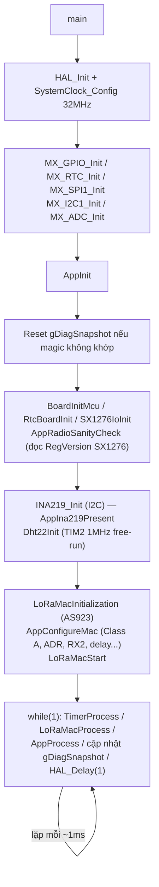
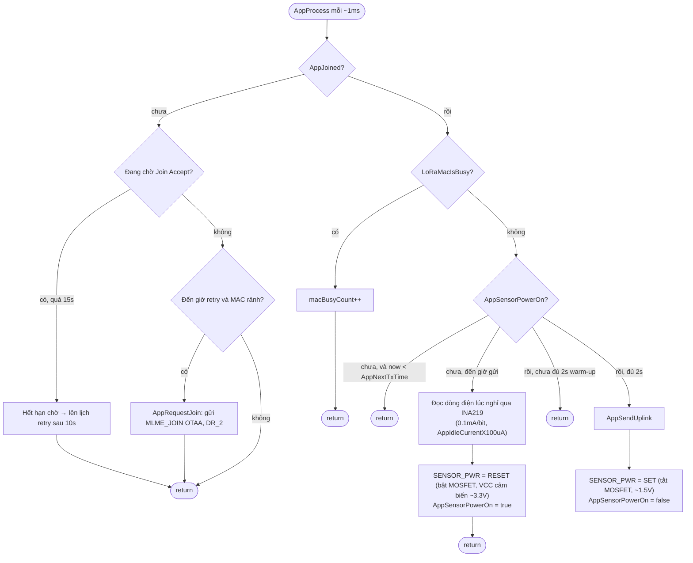

# IoT_Node — LoRaWAN Sensor Node (STM32L051 + SX1276)

Node cảm biến chạy LoRaWAN Class A, đo nhiệt độ/độ ẩm không khí, ánh sáng, độ ẩm đất, và điện áp/dòng điện pin, gửi định kỳ lên mạng LoRaWAN (qua ChirpStack hoặc network server tương thích).

## 1. Tổng quan phần cứng

| Thành phần | Chip/loại | Giao tiếp | Ghi chú |
|---|---|---|---|
| MCU | STM32L051 (Cortex-M0+) | — | Chạy PLL 32MHz (HSI 16MHz × 4 ÷ 2), Voltage Scale 1 |
| Radio LoRa | SX1276 | SPI1 | `Core/LoRaMac/radio/sx1276/` |
| Cảm biến nhiệt độ/độ ẩm | DHT22 (AM2302) | 1-wire bit-bang | `Core/LoRaMac/peripherals/dht22.c` |
| Cảm biến dòng/áp | INA219 | I2C1 | `Core/LoRaMac/peripherals/ina219.c` |
| Cảm biến ánh sáng (LDR) | — | ADC1 IN1 | `Core/Src/adc.c` |
| Cảm biến độ ẩm đất | Capacitive | ADC1 IN2 | `Core/Src/adc.c` |
| Công tắc nguồn cụm cảm biến | MOSFET qua PB5 | GPIO | **logic đảo** |

### Bảng chân cắm (`Core/Inc/main.h`, `Core/Src/gpio.c`)

| Tín hiệu | Chân | Chức năng |
|---|---|---|
| `LORA_NSS_Pin` | PA4 | SPI1 chip-select cho SX1276 |
| `LORA_RST_Pin` | PB0 | Reset SX1276 |
| `LORA_DIO0_Pin` | PB1 | Ngắt DIO0 (TxDone/RxDone), EXTI rising |
| `LORA_DIO1_Pin` | PB2 | Ngắt DIO1 (RxTimeout), EXTI rising |
| `DHT22_Pin` | PA0 | Data 1-wire DHT22, idle input pull-up |
| `SENSOR_PWR_Pin` | PB5 | Gate MOSFET cấp nguồn cụm cảm biến (DHT22 + LDR + soil) |
| I2C1 SCL/SDA | PB6/PB7 | Bus cho INA219 |
| ADC1 IN1 (LDR) | PA1 | — |
| ADC1 IN2 (soil) | PA2 | — |

## 2. Kiến trúc phần mềm

```
┌─────────────────────────────────────────────┐
│  Ứng dụng (Core/Src/main.c)                  │  ← state machine join/đo/gửi
├─────────────────────────────────────────────┤
│  Driver cảm biến tự viết                     │
│  dht22.c · ina219.c · adc.c (register-level) │
├─────────────────────────────────────────────┤
│  LoRaMac-node stack (Semtech, vendored)      │  ← Core/LoRaMac/{mac,radio,system,board}
│  MAC layer · SX1276 radio driver · Region    │
│  AS923 · soft secure-element (AES/CMAC)      │
├─────────────────────────────────────────────┤
│  STM32CubeMX HAL (gpio/i2c/adc/spi/rtc)      │  ← cmake/stm32cubemx, Drivers/
└─────────────────────────────────────────────┘
```

- **`main.c`** là toàn bộ logic ứng dụng: state machine join LoRaWAN, chu kỳ bật nguồn/đọc cảm biến/gửi uplink, và các callback bắt buộc của LoRaMac stack (`AppMacMcpsConfirm`, `AppMacMlmeConfirm`, `AppGetBatteryLevel`...).
- **LoRaMac-node** là thư viện LoRaWAN chính thức của Semtech, được vendor nguyên bản vào `Core/LoRaMac/` — không sửa trực tiếp trừ `board/rtc-board.c` (định thời) và `radio/sx1276/sx1276-board.c` (thêm bộ đếm chẩn đoán ngắt DIO0/DIO1).
- **Driver cảm biến tự viết** (`dht22.c`, `ina219.c`, `adc.c`) nằm ngoài HAL chuẩn vì gói `STM32L0xx_HAL_Driver` được vendor không kèm `stm32l0xx_hal_adc.c`, và DHT22 cần bit-bang thời gian thực không có trong HAL.

## 3. Build system

CMake, cấu hình cố định trong `CMakeLists.txt` gốc:

```cmake
set(BOARD board CACHE STRING ... FORCE)
set(RADIO sx1276 CACHE STRING ... FORCE)
set(SECURE_ELEMENT SOFT_SE CACHE STRING ... FORCE)
set(REGION_AS923 ON CACHE BOOL ... FORCE)
add_compile_options(-Os)   # tối ưu kích thước, flash STM32L051 hạn chế
```

Build (ví dụ với Ninja/Make, tuỳ toolchain đã cấu hình sẵn trong `cmake/`):

```sh
cmake --preset Debug      # hoặc cấu hình tương ứng trong CMakePresets.json
cmake --build build/Debug
```

Sau build, `IoT_Node.elf` được copy về thư mục gốc project để tiện lệnh nạp (`add_custom_command ... POST_BUILD` trong `CMakeLists.txt`).

## 4. Luồng hoạt động tổng quát



MCU **không có chế độ ngủ** (không `__WFI`/STOP mode) — vòng lặp chính chạy liên tục ở 32MHz, chỉ có `HAL_Delay(1)` bận-chờ giữa các lần lặp. Đây là điểm cần lưu ý cho ngân sách pin (xem mục 9).

## 5. State machine `AppProcess()`

Đây là "trái tim" của ứng dụng, được gọi mỗi ~1ms từ vòng lặp chính.



Ghi chú các mốc thời gian (`main.c`):

| Hằng số | Giá trị | Ý nghĩa |
|---|---|---|
| `APP_TX_PERIOD_MS` | 30000ms | Chu kỳ gửi tối thiểu (còn phụ thuộc `DutyCycleWaitTime` do MAC trả về) |
| `SENSOR_POWERON_DELAY_MS` | 2000ms | Thời gian làm nóng cảm biến trước khi đọc |
| `APP_JOIN_RETRY_MS` | 10000ms | Thử join lại sau khi thất bại |
| `APP_JOIN_CONFIRM_WAIT_MS` | 15000ms | Timeout chờ Join Accept |

## 6. Chu kỳ gửi dữ liệu — `AppSendUplink()`

```mermaid
flowchart TD
    A([AppSendUplink]) --> B{AppIna219Present?}
    B -- có --> B1[Đọc bus voltage (mV) + current (mA)]
    B -- không --> B2[busVoltageMv=0, currentMa=0]
    B1 --> C
    B2 --> C[AppComputeBatteryLevel → byte 0-4]
    C --> D[Dht22Read: nhiệt độ + độ ẩm]
    D -->|thành công| D1[dhtOkCount++]
    D -->|thất bại| D2["dhtFailCount++\n(temperatureCx10/humidityPctx10 giữ 0)"]
    D1 --> E
    D2 --> E["gDiagSnapshot.dhtLastStage = gDht22LastStage"]
    E --> F["AdcReadChannel(CHSEL1) → lightRaw\nAdcReadChannel(CHSEL2) → soilRaw"]
    F --> G["Đóng gói AppTxBuffer[0..13]\n(xem bảng payload mục 8)"]
    G --> H["LoRaMacMcpsRequest (MCPS_UNCONFIRMED,\nfPort=2, DR_4)"]
    H -->|OK| H1["AppNextTxTime = now + max(DutyCycleWaitTime, 30s)\nAppFrameCounter++"]
    H -->|lỗi| H2["AppNextTxTime = now + 30s"]
```

## 7. Đọc cảm biến DHT22 — `Dht22Read()` (`dht22.c`)

DHT22 dùng giao thức 1-wire bit-bang tự triển khai (không có driver HAL cho việc này). MCU Cortex-M0+ không có DWT cycle counter nên dùng **TIM2 free-run ở 1MHz** làm đồng hồ đo vi giây, kết hợp `HAL_GetTick()` làm giới hạn dự phòng (5ms) để không bao giờ treo máy nếu cảm biến mất kết nối.

> **Lưu ý kiến trúc quan trọng**: `Core/LoRaMac/board/rtc-board.c` (lớp định thời của LoRaMac) *cũng* dùng TIM2, và luôn dừng nó (`Tim2Stop()`) mỗi khi LoRaMac hẹn giờ nội bộ — điều này xảy ra rất sớm (trong quá trình join), trước khi có lần đọc DHT22 đầu tiên. Vì vậy `Dht22Read()` phải **tự tái khởi động TIM2** (`Dht22TimerStart()`) ở đầu mỗi lần đọc, không chỉ một lần lúc `Dht22Init()` — nếu bỏ bước này, bộ đếm sẽ đứng yên và toàn bộ bit sẽ bị decode sai thành 0.

```mermaid
flowchart TD
    A([Dht22Read]) --> B[Dht22TimerStart: tái cấu hình TIM2 1MHz free-run]
    B --> C["Kéo bus xuống LOW 10ms (start signal)\nDht22SetOutputLow + HAL_Delay(10)"]
    C --> D["Nhả bus về input pull-up\nDht22SetInput"]
    D --> E{"Chờ bus lên HIGH\n(timeout 1000us / 5ms)"}
    E -- timeout --> F1[stage=1, return false]
    E -- OK --> G{Chờ sensor kéo LOW (ACK)}
    G -- timeout --> F2[stage=2, return false]
    G -- OK --> H{Chờ sensor thả HIGH (ACK)}
    H -- timeout --> F3[stage=3, return false]
    H -- OK --> I{"Chờ LOW\n(= lead pulse của bit đầu tiên)"}
    I -- timeout --> F4[stage=4, return false]
    I -- OK --> LoopStart["Lặp 40 bit (5 byte): humidity(2) temp(2) checksum(1)"]

    LoopStart --> L1{"Chờ lead pulse HIGH\n(timeout 150us)"}
    L1 -- timeout --> F5["stage = 10+bitIndex\nreturn false"]
    L1 -- OK --> L2{"Đo độ rộng xung HIGH\n(timeout 150us)"}
    L2 -- timeout --> F6["stage = 50+bitIndex\nreturn false"]
    L2 -- OK --> L3{"HighUs > 40us?"}
    L3 -- có --> L4[bit = 1]
    L3 -- không --> L5[bit = 0]
    L4 --> LoopNext{Còn bit?}
    L5 --> LoopNext
    LoopNext -- còn --> L1
    LoopNext -- hết --> Chk{"checksum = data0+1+2+3 == data4?"}
    Chk -- sai --> F7[stage=90, return false]
    Chk -- đúng --> Ok["stage=0\ntemperatureCx10 / humidityPctx10\nreturn true"]
```

Định dạng dữ liệu thô DHT22 (khác DHT11): `humidity = (data[0]<<8 | data[1])` tenths of %, `temperature = (data[2]&0x7F)<<8 | data[3]` tenths of °C, bit 7 của `data[2]` là dấu âm.

## 8. Cảm biến dòng/áp INA219 (`ina219.c`)

- I2C1, địa chỉ mặc định `0x40` (A0/A1 nối GND).
- Hiệu chuẩn cho shunt 0.1Ω, dải 32V/2A → `Current_LSB = 0.1mA/bit`. Thanh ghi calibration được **ghi lại trước mỗi lần đọc dòng** vì có thể bị reset về 0 sau brown-out nguồn.
- 3 hàm đọc:
  - `INA219_ReadBusVoltage_mV()` — điện áp bus, độ phân giải 4mV/bit.
  - `INA219_ReadCurrent_mA()` — dòng điện, làm tròn về mA nguyên (dùng cho payload chính, byte 3-4).
  - `INA219_ReadCurrent_x100uA()` — dòng điện ở độ phân giải gốc 0.1mA/bit (dùng cho byte dòng nghỉ, byte 13), tránh mất độ phân giải khi dòng nhỏ.

## 9. ADC ánh sáng & độ ẩm đất (`adc.c`)

Driver ADC1 mức thanh ghi (không dùng `HAL_ADC_*` vì gói HAL vendor không kèm `stm32l0xx_hal_adc.c`):

- Tự hiệu chuẩn (`ADC_CR_ADCAL`) lúc `MX_ADC_Init()`, dùng thời gian lấy mẫu dài nhất (`ADC_SMPR_SMP`) vì cảm biến có trở kháng ra cao.
- `AdcReadChannel(ADC_CHSELR_CHSEL1)` → LDR (PA1), `AdcReadChannel(ADC_CHSELR_CHSEL2)` → soil (PA2). Kết quả 12-bit right-aligned (0-4095), trả về 0 nếu timeout.

## 10. Điều khiển nguồn cụm cảm biến (PB5)

**Quan trọng — logic MOSFET bị đảo so với trực giác thông thường**, đã xác nhận bằng đo thực tế:

| `SENSOR_PWR_Pin` | VCC cụm cảm biến | Trạng thái |
|---|---|---|
| `GPIO_PIN_RESET` (0V) | ~3.3V | **Bật** (MOSFET dẫn) |
| `GPIO_PIN_SET` (3.3V) | ~1.5V (rò qua MOSFET) | **Tắt** (không đủ áp để cảm biến hoạt động) |

Do đó trong code: mặc định lúc boot (`gpio.c`) và sau khi gửi xong (`main.c`) đều set **`GPIO_PIN_SET`** (tắt), còn lúc chuẩn bị đọc thì set **`GPIO_PIN_RESET`** (bật) — ngược lại tên gọi `SET`/`RESET` thông thường hay gợi ý. Đây từng là nguyên nhân khiến DHT22 và cảm biến đất không đọc được dữ liệu (cảm biến chỉ nhận 1.5V mỗi khi "được bật").

## 11. Định dạng payload LoRaWAN

FPort **2**, **14 byte**, big-endian (`chirpstack-decoder.js` giải mã khớp bảng này):

| Byte | Kiểu | Trường | Ghi chú |
|---|---|---|---|
| 0 | uint8 | `batteryLevel` | 0=nguồn ngoài, 1-254=mức pin, 255=không đo được |
| 1-2 | uint16 | `busVoltage_mV` | Điện áp bus từ INA219 |
| 3-4 | int16 | `current_mA` | Dòng điện lúc gửi (tải cao) |
| 5-6 | int16 | `temperature_C` ×10 | Từ DHT22 |
| 7-8 | uint16 | `humidity_percent` ×10 | Từ DHT22 |
| 9-10 | uint16 | `light_raw` | ADC1 IN1, 0-4095 |
| 11-12 | uint16 | `soilMoisture_raw` | ADC1 IN2, 0-4095 |
| 13 | uint8 | `idleCurrent_mA` ×10 | Dòng lúc nghỉ (0.1mA/bit), đo ngay trước khi bật cảm biến — **MCU vẫn đang chạy full-speed lúc đo**, không phải dòng sleep thật |

Datarate gửi cố định `DR_4` (`APP_TX_DATARATE`) — bắt buộc set lại datarate ADR sau khi join xong (`AppMacMlmeConfirm`) vì ADR bỏ qua `McpsRequest.Datarate` một khi đã bật, nếu không payload 14 byte sẽ vượt giới hạn datarate join (`LORAMAC_STATUS_LENGTH_ERROR`).

## 12. Chẩn đoán khi không có UART

Project **không có UART/printf** — toàn bộ quan sát trạng thái runtime dựa vào struct `gDiagSnapshot` (`main.c`), đặt trong section `.noinit` nên **sống sót qua reset** (chỉ mất khi mất nguồn hoàn toàn), đọc được bằng ST-Link Utility/STM32CubeProgrammer hoặc debugger (Live Expressions):

| Trường | Ý nghĩa |
|---|---|
| `isJoined`, `joinReqCount`, `frameCounter` | Trạng thái LoRaWAN |
| `macBusyCount` | Số lần `AppProcess` phải chờ vì MAC bận |
| `dio0IrqCount`, `dio1IrqCount` | Số ngắt radio (TxDone/RxDone, RxTimeout) |
| `dhtOkCount`, `dhtFailCount`, `dhtLastStage` | Kết quả đọc DHT22, xem mã lỗi ở `dht22.h` |
| `lightRaw`, `soilRaw` | Giá trị ADC thô lần đọc gần nhất |

`gDht22LastStage` (`dht22.h`) là mã lỗi chi tiết nhất: `0`=thành công, `1-4`=lỗi từng bước bắt tay, `10-49`=lỗi lead-pulse của bit, `50-89`=lỗi data-pulse của bit, `90`=sai checksum.

## 13. Vấn đề giới hạn hiện tại

1. **Không có chế độ tiết kiệm điện (STOP mode)** — MCU chạy full-speed 32MHz liên tục kể cả lúc "nghỉ" giữa các chu kỳ gửi. Muốn thêm STOP mode cần viết lại cơ chế định thời của `rtc-board.c` (hiện dựa hoàn toàn vào `HAL_GetTick()`/SysTick, vốn dừng đếm khi MCU vào STOP mode) để bù thời gian đã ngủ sau khi thức dậy.
2. **MOSFET nguồn cảm biến không tắt hẳn** — trạng thái "tắt" vẫn để lại ~1.5V trên VCC cụm cảm biến (xem mục 10), có thể còn dòng rò nhỏ ngay cả lúc nghỉ.
3. **TIM2 dùng chung** giữa `rtc-board.c` và `dht22.c` — đã xử lý bằng cách tái chiếm TIM2 ở đầu mỗi lần đọc DHT22 (mục 7), nhưng là điểm cần lưu ý nếu sau này thêm module nào khác cũng cần TIM2.
4. **Không có UART debug** — chỉ chẩn đoán được qua `gDiagSnapshot` bằng debugger (mục 12).

## 14. Hướng dẫn build & nạp nhanh

```sh
# Cấu hình + build (Debug preset đã khai báo sẵn trong CMakePresets.json)
cmake --preset Debug
cmake --build build/Debug

# Nạp firmware (ví dụ dùng STM32CubeProgrammer CLI, tuỳ đầu nạp thực tế)
STM32_Programmer_CLI -c port=SWD -w build/Debug/IoT_Node.elf -v -rst
```

Sau khi nạp, để board join mạng (vài chục giây), quan sát `gDiagSnapshot.isJoined` và `frameCounter` qua debugger để xác nhận đã gửi được uplink.
